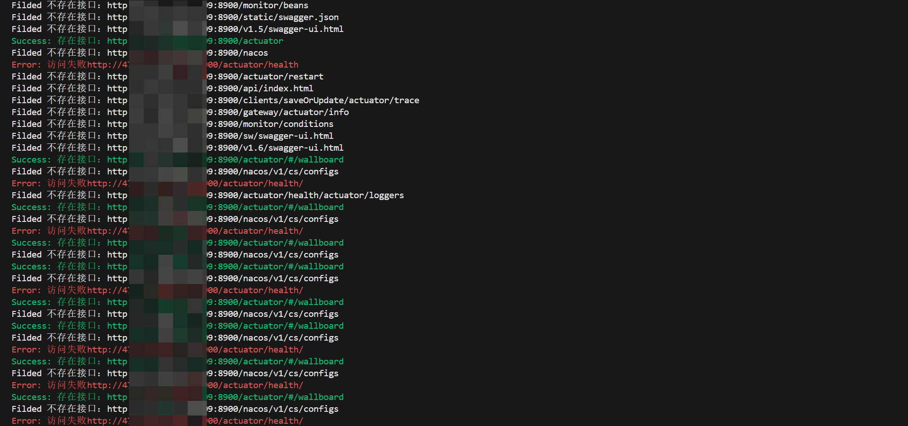
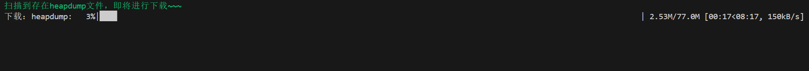

## SpringBoot 漏洞扫描利用工具

### 使用教程：
    默认优先使用收集路径进行扫描（springboot_urls.txt）
    当扫描不存在接口时，使用api前缀拼接扫描，可以自行添加
    
### 扫描URL：
    本工具不想使用参数方式（记性不好，时不时就忘了参数是啥~~~）
    需要扫描的url直接放在urls.txt里面即可
    
### 结果保存：
    扫描结果以及下载的heapdump文件最终保存在result路径

### 命令：
    python3 main.py

## 运行结果

